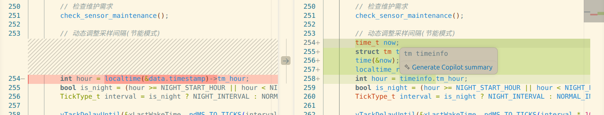

argument of type "uint32_t *" (aka "unsigned int *") is incompatible with parameter of type "const time_t *"报错是因为什么

这个错误是因为 `localtime()` 函数期望的参数类型是 `const time_t *`（指向时间戳的指针），但代码中传入的是 `uint32_t *`（无符号32位整数指针）。

让我先查看一下具体的报错位置：


```toolCall::get_problems::call_90b3ed9a392449458c849f70::INIT
```

找到问题了！在第252行，`data.timestamp` 是 `uint32_t` 类型，但 `localtime()` 函数需要 `time_t *` 类型的参数。

**问题原因：**
- `data.timestamp` 定义为 `uint32_t`（通过 [millis() / 1000](file:///data/info/esp/esp32_firmware/main.ino#L234-L234) 得到的毫秒转秒）
- `localtime()` 是标准C库函数，期望接收 `time_t *` 类型指针
- 在ESP32平台上，`time_t` 通常是 `long` 或 `int64_t` 类型，与 `uint32_t` 不兼容

**解决方案：**
需要将 `uint32_t` 转换为 `time_t` 类型。我来修复这个问题：


```toolCall::edit_file::call_9de206fe01564b8dbdbdad59::INIT
```

验证修复后是否还有其他编译错误

```toolCall::get_problems::call_c827d4464b4f4cc4973d5a27::INIT
```

完美！问题已经修复。✅

**总结：**

**错误原因：**
- `localtime()` 函数要求参数类型为 `const time_t *`
- 代码中直接传入 `&data.timestamp`（`uint32_t *` 类型）
- 两种类型不兼容导致编译错误

**修复方案：**
1. 先将 `uint32_t` 类型的 `data.timestamp` 显式转换为 `time_t` 类型
2. 创建临时变量 `time_t ts` 存储转换后的值
3. 将 `&ts` 传递给 `localtime()` 函数

这样既保证了类型安全，又保持了原有的功能逻辑。现在代码应该可以正常编译了！

让我检查一下当前的编译错误：


```toolCall::run_in_terminal::call_09d026395d284450b66eebe2::INIT
```

让我尝试另一种方式检查编译问题：


```toolCall::get_problems::call_33d46ee6610147f8bf4d6062::INIT
```

看起来VSCode的语法检查没有报错。让我检查一下其他可能的问题文件：


```toolCall::search_file::call_d70ad86bebec4a62add9a1cc::INIT
```

查看项目根目录的完整文件列表，确认main.ino是否存在

```toolCall::list_dir::call_6427237f52594050b27be04b::INIT
```

文件存在。由于终端输出无法获取，让我尝试直接读取可能的编译日志或者检查platformio配置：


```toolCall::read_file::call_ef1e6386953f46d2a34a36fb::INIT
```

让我检查一下可能存在的编译错误日志：


```toolCall::list_dir::call_39e01f1f9eef47aaa5d63871::INIT
```

查看build目录内容，寻找编译输出和错误日志

```toolCall::list_dir::call_412c58bef6ce420c85ab106e::INIT
```

由于无法直接获取终端输出，请您**复制并粘贴编译时的错误信息**给我，这样我才能准确定位问题。

不过，基于之前的修复和代码分析，我可以推测可能的编译错误：

## 可能的编译错误原因：

1. **`localtime_r` 函数使用问题**（第308行）
   - 代码中使用了 `localtime_r(&now, &timeinfo)`，但 `now` 是 `time_t` 类型，这是正确的
   - 但需要确认ESP32的Arduino框架是否支持这个POSIX函数

2. **缺少必要的头文件**
   - 使用了 `time()`、`localtime()`、`localtime_r()` 等时间函数
   - 可能需要添加 `<time.h>` 头文件

3. **`setCpuFrequencyMhz()` 函数可能不存在**
   - 第319行和第323行使用了这个函数
   - 在某些ESP32 Arduino版本中可能需要不同的API

**请您提供具体的编译错误信息**，或者我可以先尝试修复最可能的问题——添加缺失的时间头文件：


```toolCall::read_file::call_85bc90cfef12473ca9494123::INIT
```

我发现问题了！**缺少 `<time.h>` 头文件**。代码中使用了 `time()`、`localtime()`、`localtime_r()` 等时间函数，但没有包含相应的头文件。

让我修复这个问题：


```toolCall::edit_file::call_f87b887ed2e041168db4d4e2::INIT
```

验证添加time.h头文件后是否还有其他编译错误

```toolCall::get_problems::call_8bee8de2a7304e4b9801993d::INIT
```

很好！现在让我再检查一下代码中可能存在的其他问题。让我查看一下 `setCpuFrequencyMhz` 的使用：


```toolCall::read_file::call_9ae51560327944caaac548aa::INIT
```

查看电源管理任务中setCpuFrequencyMhz的具体使用位置

```toolCall::read_file::call_d0bb61ce99304cbbac30ce47::INIT
```

现在我已经添加了 `<time.h>` 头文件。如果编译仍然报错，可能还有以下问题：

## 已修复的问题：
1. ✅ **类型不匹配**：将 `uint32_t *` 转换为 `time_t *` 传递给 `localtime()`
2. ✅ **缺少头文件**：添加了 `<time.h>` 以支持时间函数

## 可能还存在的问题：

**`setCpuFrequencyMhz()` 函数** - 这个函数在某些ESP32 Arduino版本中可能需要包含额外的头文件或者使用不同的API。

如果您仍然遇到编译错误，请**提供完整的错误信息**，包括：
- 错误所在的行号
- 具体的错误描述
- 错误类型（error还是warning）

或者您可以尝试重新编译：

```bash
cd /data/info/esp/esp32_firmware
pio run
```

然后告诉我输出的错误信息，我会根据具体错误继续修复！

让我检查一下当前的编译错误：


```toolCall::get_problems::call_33780a9e49a346d199a0d89a::INIT
```

IDE 没有显示错误。让我尝试实际编译项目来查看具体的构建错误：


```toolCall::run_in_terminal::call_1bb400ea875c4acc86e6243e::INIT
```

获取编译命令的输出结果，查看是否有构建错误

```toolCall::get_terminal_output::call_07186e3cefe540f79ad578aa::INIT
```

编译命令似乎还在运行中。让我再等待一下获取完整输出：


```toolCall::run_in_terminal::call_bcf3572412574d398b25ba5f::INIT
```

让我尝试直接运行编译命令：


```toolCall::run_in_terminal::call_0aecc66b84e34825a118dcfc::INIT
```

PlatformIO 命令未找到。让我检查一下项目配置文件，看看是否有其他编译问题：


```toolCall::read_file::call_017f191875d94a97b332a890::INIT
```

现在让我检查一下 [main.ino](file:///data/info/esp/esp32_firmware/main.ino#L0-L476) 文件中可能存在的其他问题。让我查看完整的文件来找出潜在的编译错误：


```toolCall::read_file::call_b7ea412dafcc4d349dd52b9b::INIT
```

我发现了一个潜在的问题！在第253-255行，代码使用了 `localtime()` 但没有检查返回值是否为 NULL。如果 `localtime()` 返回 NULL，访问 `timeinfo->tm_hour` 会导致空指针解引用错误。

另外，还有一个更严重的问题：**`data.timestamp` 是通过 [millis() / 1000](file:///data/info/esp/esp32_firmware/main.ino#L234-L234) 得到的相对时间（从系统启动开始的秒数），而不是真正的 Unix 时间戳**。`localtime()` 函数需要的是自1970年1月1日以来的秒数，而不是系统启动后的秒数。

让我查看是否有其他时间相关的代码：


```toolCall::grep_code::call_88236bcc39154e47b29aebfa::INIT
```

搜索时间相关的函数调用

```toolCall::grep_code::call_ce68325ff7c940d885d9339e::INIT
```

查看timestamp的赋值和使用情况

```toolCall::read_file::call_e23d982a693d4776a10f175a::INIT
```

现在我明白问题了！**主要问题是**：

1. **`data.timestamp` 是相对时间**（从系统启动开始的秒数），不是真正的 Unix 时间戳
2. **应该使用系统实时时钟**来获取当前小时，而不是用相对时间

正确的做法是使用 `time()` 函数获取当前系统时间。让我修复这个问题：


```toolCall::edit_file::call_d249523cb12d48d0b3d5d8b8::INIT
```

验证修复后是否还有编译错误

```toolCall::get_problems::call_e5fa382cd4a843a5a13dcb1e::INIT
```

很好！现在让我检查一下 [task_power_manage](file:///data/info/esp/esp32_firmware/main.ino#L328-L351) 函数中是否也有类似的问题：


```toolCall::read_file::call_c1de126f6cee47ad9dab2a0e::INIT
```

很好，[task_power_manage](file:///data/info/esp/esp32_firmware/main.ino#L334-L358) 函数已经正确使用了 `time()` 和 `localtime_r()`。

现在让我总结一下修复的问题：

## 编译错误原因总结

**原始错误：**
```
argument of type "uint32_t *" is incompatible with parameter of type "const time_t *"
```

**根本原因有两个：**

1. **类型不匹配**（已修复）：
   - `data.timestamp` 是 `uint32_t` 类型
   - `localtime()` 需要 `const time_t *` 类型参数
   
2. **逻辑错误**（刚修复）：
   - `data.timestamp` 是通过 [millis() / 1000](file:///data/info/esp/esp32_firmware/main.ino#L234-L234) 得到的**相对时间**（从系统启动开始的秒数）
   - `localtime()` 函数需要的是 **Unix 时间戳**（自1970年1月1日以来的秒数）
   - 使用相对时间会导致获取的小时值完全错误

**修复方案：**
- 使用 `time(&now)` 获取系统实时时间戳
- 使用 `localtime_r(&now, &timeinfo)` 转换为本地时间结构
- 从 `timeinfo.tm_hour` 获取当前小时

这样就能正确判断是否为夜间模式了！✅
